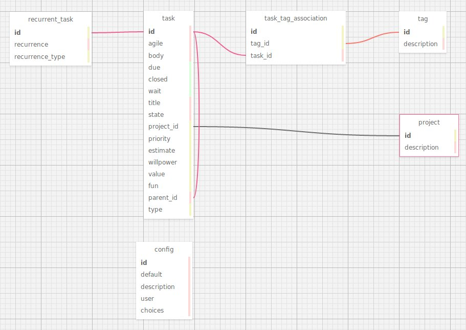

The schema is defined in the
[models.py](https://github.com/lyz-code/pydo/blob/master/pydo/models.py) file
through
[SQLAlchemy](https://lyz-code.github.io/blue-book/coding/python/sqlalchemy/)
objects.

To visualize the schema we've used
[wwwsqldesigner](https://github.com/ondras/wwwsqldesigner/wiki) through their
[hosted instance](https://ondras.zarovi.cz/sql/demo/). We load the
[database_schema.xml](https://github.com/lyz-code/pydo/tree/master/pydo/migrations/sql_schema.xml)
to modify it and save it back as xml in the repo.

